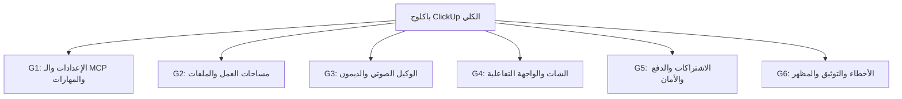
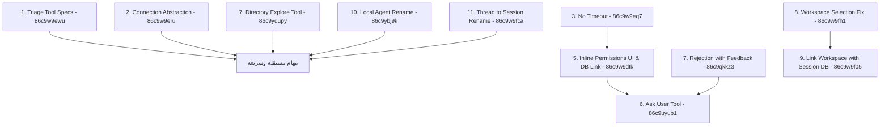
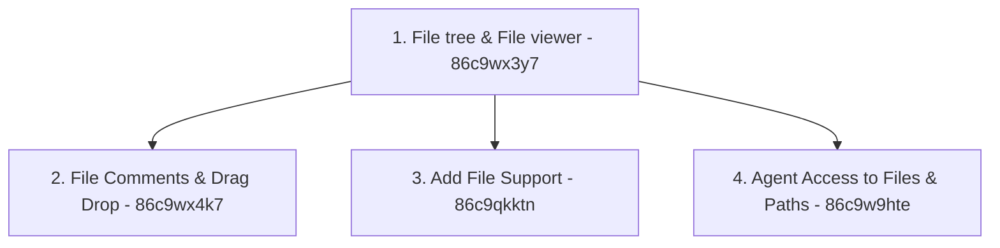

# دليل وخارطة طريق إعادة هيكلة وتصفية الباكلوج (Backlog Refactoring & Triage Roadmap)

تحدد هذه الوثيقة المنهجية الرسمية لتصنيف وتصفية وتفكيك **جميع مهام الباكلوج النشطة (61 مهمة)** على كليك أب لضمان عدم إهمال أو نسيان أي مهمة، وترجمتها إلى مهام مصغرة واضحة وقابلة للفحص والتحقق آلياً ويدوياً (DoD).

---

## 📂 المجموعات الست لتصنيف الباكلوج (Epic Categorization)

تم توزيع كافة المهام النشطة على 6 مجموعات وظيفية مترابطة:

---

## ⛓️ خارطة التبعيات وترتيب التنفيذ للمجموعات (Dependency Graph & Execution Order)

لكي يستطيع الوكيل (أو المطور) الذي يقرأ هذا المستند تنفيذ المهام بنجاح وبشكل مؤتمت دون أي تضارب، يجب اتباع **ترتيب التنفيذ الرقمي الصارم** للمجموعات الموضحة أدناه:

### 1️⃣ المجموعة الأولى: إعدادات التطبيق والـ MCP والمهارات (Settings, MCP & Skills)

* **الترتيب #1 (مستقل):** `86c9w9ewu` (تنقية مواصفات الأدوات لتقليل الرموز).
* **الترتيب #2 (تأسيسي):** `86c9w9eru` (تجريد طبقة الاتصال والـ Streams لتمكين تشغيل التطبيق بكفاءة على الويب/الموبايل/الدسك توب).
* **الترتيب #3 (ممهد):** `86c9w9eq7` (بناء checkpoint/resume كامل للمنعطفات المعلقة على الإذن داخل `sanadagent-local`).
* **الترتيب #4 (بناء الواجهة):** `86c9w9dtk` (تصميم واجهة Inline Permissions فوق checkpoint/resume الموحد دون التفريق بين قبل/بعد restart).
* **الترتيب #5 (مبني على #4):** `86c9uyub1` (إضافة أداة "اسأل المستخدم" مستفيدة من الـ Inline view المدمج).
* **الترتيب #6 (تجهيز منطق الرد):** `86c9qkkz3` (معالجة رفض الأدوات وتقديم الملاحظات feedback).
* **الترتيب #7 (مستقل وتأسيسي للوكيل):** `86c9ydupy` (إضافة أداة استكشاف وتحليل مسار محدد للوكيل تمكنه من استكشاف الملفات والمجلدات داخل مساحة العمل).
* **الترتيب #8 (تأسيسي):** `86c9w9fh1` (إصلاح تصفح واختيار مساحة العمل بذكاء بين محلي/بعيد).
* **الترتيب #9 (مبني على #8):** `86c9w9f05` (حفظ وربط مساحة العمل المحددة بالجلسة في قاعدة البيانات).
* **الترتيب #10 (مستقل):** `86c9ybj9k` (تغيير اسم الوكيل المحلي ومساره من sanadagent-local الي sanad-agent).
* **الترتيب #11 (مستقل):** `86c9w9fca` (اريد تغيير كلمة thread الي session علي مستوي المشروع).

---

### 2️⃣ المجموعة الثانية: مساحات العمل والمجلدات والملفات (Workspaces & Files)

* **الترتيب #1 (تأسيسي):** `86c9wx3y7` (بناء شجرة الملفات وعارض الملفات الجانبي، يعتمد بصرياً على اختيار مساحة العمل في المجموعة الأولى).
* **الترتيب #2 (مبني على #1):** `86c9wx4k7` (دعم السحب والإفلات والتعليق التفاعلي على الملفات).
* **الترتيب #3 (مبني على #1):** `86c9qkktn` (إضافة ودعم صيغ الملفات المختلفة داخل محادثات وتفضيلات الوكيل).
* **الترتيب #4 (مبني على #1):** `86c9w9hte` (منح الوكيل صلاحيات وصول متكاملة ومتحكم بها للملفات والمسارات المختارة).

---

### 1️⃣ المجموعة الأولى: إعدادات التطبيق والـ MCP والمهارات (Settings, MCP & Skills)
*تضم المهام المرتبطة بالـ MCP، المهارات، الأذونات، وتصميم صفحة الإعدادات الجديدة.*

| معرف المهمة | اسم المهمة | الترتيب | حالة التخطيط | حالة التنفيذ | ملف الخطة |
| :--- | :--- | :---: | :---: | :---: | :--- |
| `86c9w9ewu` | تنقية مواصفات الأدوات للوكيل (Triage Tool Specs for LLM) | **#1** | 📝 تمت صياغة الخطة | ✅ تم التنفيذ | [86c9w9ewu-tools-definitions-llm.md](tasks/done/86c9w9ewu-tools-definitions-llm.md) |
| `86c9w9eru` | تجريد طبقة الاتصال والـ Streams (Connection Abstraction) | **#2** | 📝 تمت صياغة الخطة | ✅ تم التنفيذ | [86c9w9eru-generalized-connection-streams.md](tasks/done/86c9w9eru-generalized-connection-streams.md) |
| `86c9w9eq7` | بناء checkpoint/resume كامل لطلبات الأذونات (Full Permission Checkpoint/Resume) | **#3** | 📝 تمت صياغة الخطة | ✅ تم التنفيذ | [86c9w9eq7-no-timeout-permissions.md](tasks/done/86c9w9eq7-no-timeout-permissions.md) |
| `86c9w9dtk` | فيو طلب الأذونات المدمج فوق checkpoint/resume (Inline Permissions on Checkpoint/Resume) | **#4** | 📝 تمت صياغة الخطة | ✅ تم التنفيذ | [86c9w9dtk-inline-permissions-workspace-link.md](tasks/done/86c9w9dtk-inline-permissions-workspace-link.md) |
| `86c9uyub1` | إضافة أداة "اسأل المستخدم" والواجهة المرتبطة بها (Ask User Tool & View) | **#5** | 📝 تمت صياغة الخطة | ✅ تم التنفيذ | [86c9uyub1-ask-user-tool-view.md](tasks/done/86c9uyub1-ask-user-tool-view.md) |
| `86c9qkkz3` | معالجة رفض الأدوات وتقديم الملاحظات للوكيل (Tool Rejection with Feedback) | **#6** | 📝 تمت صياغة الخطة | ✅ تم التنفيذ | [86c9qkkz3-rejection-feedback-handling.md](tasks/done/86c9qkkz3-rejection-feedback-handling.md) |
| `86c9ydupy` | إضافة أداة استكشاف وتحليل مسار محدد للوكيل (Add Directory Explore/List Tool) | **#7** | 📝 تمت صياغة الخطة | ✅ تم التنفيذ | [86c9ydupy-directory-explore-tool.md](tasks/done/86c9ydupy-directory-explore-tool.md) |
| `86c9w9fh1` | إصلاح اختيار مساحة العمل الذكي (Smart Workspace Selection Fix) | **#8** | 📝 تمت صياغة البدء | ✅ تم التنفيذ | [86c9w9fh1-workspace-selection-fix.md](tasks/done/86c9w9fh1-workspace-selection-fix.md) |
| `86c9w9f05` | ربط مساحة العمل بالجلسة في قاعدة البيانات (Link Workspace with Session in DB) | **#9** | 📝 تمت صياغة البدء | ✅ تم التنفيذ | [86c9w9f05-workspace-session-db-link.md](tasks/done/86c9w9f05-workspace-session-db-link.md) |
| `86c9ybj9k` | تغيير اسم الوكيل المحلي ومساره من sanadagent-local الي sanad-agent | **#10** | ⏳ لم يتم التخطيط | ⏳ لم يتم التنفيذ | — |
| `86c9w9fca` | اريد تغيير كلمة thread الي session علي مستوي المشروع | **#11** | ⏳ لم يتم التخطيط | ⏳ لم يتم التنفيذ | — |
| `86c9w9e2u` | مشكلة عدم استقبال الادوات التي تعلنها الواجهه (Fix Client Tools Declaration) | — | 📝 تمت صياغة البدء | ⏳ لم يتم التنفيذ | [86c9w9e2u-declare-client-tools.md](tasks/86c9w9e2u-declare-client-tools.md) |
| `86c9wm5xt` | اضافة المهارات بشكل مسبق | — | ⏳ لم يتم التخطيط | ⏳ لم يتم التنفيذ | — |
| `86c9qkmrd` | اضافة صفحة المهارات | — | ⏳ لم يتم التخطيط | ⏳ لم يتم التنفيذ | *(دمجت بصرياً في الإعدادات)* |
| `86c9qkm0q` | تعديل الفيو الخاص بطلب اذن التنفيذ | — | ⏳ لم يتم التخطيط | ⏳ لم يتم التنفيذ | *(دمجت بصرياً في #4)* |
| `86c9mr9gw` | تعديل صفحة إدارة الوكلاء (Agent Management) | — | ⏳ لم يتم التخطيط | ⏳ لم يتم التنفيذ | *(تجاهل مؤقتاً)* |
| `86c9mr9gm` | تعديل صفحة الإعدادات (Settings Page) | — | ⏳ لم يتم التخطيط | ⏳ لم يتم التنفيذ | — |
| `86c9uyu8w` | نقل الادوات وال mcp والمهارات | — | ✅ مغلقة | ✅ تم التنفيذ | *(مغلقة - للتدقيق)* |
| `86c9uyu9m` | اضافة الورك بليس والاذونات | — | ✅ مغلقة | ✅ تم التنفيذ | *(مغلقة - للتدقيق)* |

---

### 2️⃣ المجموعة الثانية: إدارة مساحات العمل والمجلدات والملفات (Workspaces & Files)
*تضم المهام المرتبطة بتصفح المجلدات محلياً، شجرة الملفات، وعارض الملفات.*

| معرف المهمة | اسم المهمة | الترتيب | حالة التخطيط | حالة التنفيذ | ملف الخطة |
| :--- | :--- | :---: | :---: | :---: | :--- |
| `86c9wx3y7` | شجرة تصفح المجلدات وعارض الملفات (File tree & File viewer) | **#1** | 📝 تمت صياغة البدء | ⏳ لم يتم التنفيذ | [86c9wx3y7-file-tree-viewer.md](tasks/86c9wx3y7-file-tree-viewer.md) |
| `86c9wx4k7` | التعليق على الملفات والسحب والإفلات (File Comments & Drag and Drop) | **#2** | ⏳ لم يتم التخطيط | ⏳ لم يتم التنفيذ | — |
| `86c9qkktn` | إضافة الدعم الشامل للملفات (Add File Support) | **#3** | ⏳ لم يتم التخطيط | ⏳ لم يتم التنفيذ | — |
| `86c9w9hte` | منح الوكيل صلاحية الوصول للملفات والمسارات (Give Agent Access to Files/Paths) | **#4** | 📝 تمت صياغة الخطة | ✅ تم التنفيذ | — |

---

### 3️⃣ المجموعة الثالثة: الوكيل الصوتي والديمون والاتصال (Voice & Daemon Integration)
*تضم المهام المرتبطة بالاتصال المحلي، أداء الديمون، والوكيل الصوتي.*

*   **خريطة طريق معمارية الصوت المباشر والـ Realtime:** [Realtime Duplex Voice Architecture Plan](realtime_voice_architecture.md)
    *   مهمة `voice01a`: [بناء جسر الصوت في الديمون المحلي (WebSocket Bridge & Cloud Relay)](tasks/voice01a-daemon-websocket-bridge.md)
    *   مهمة `voice01b`: [دمج البث الصوتي والـ VAD في تطبيق Flutter (Client Audio Streamer & VAD)](tasks/voice01b-client-audio-streaming.md)
    *   مهمة `voice01c`: [بناء مرحل الصوت والتحكم في الباك اند (FastAPI Socket.IO Voice Relay)](tasks/voice01c-backend-socketio-relay.md)
*   **خطة تصفية وتطهير LiveKit من المشروع:** [LiveKit Deprecation & Purge Roadmap](livekit_purge_roadmap.md)
*   `86c9wy2yd` — عند تشغيل التطبيق اذا كان جهاز سطح مكتب يجب ان يتاكد من تشغيل واتصال مع السرفر المحلي.
*   `86c9wy2xn` — لما بيفتح التطبيق ومش ومفيش اتصال بالسرفر السحابي مش بيتصل بالسرفر المحلي daemon.
*   `86c9wx250` — تسجيل الديمون علي انه تطبيق خلفيه علي النظام.
*   `86c9w9e7e` — تجميع وتصحيح طريقة الاتصال في مكان واحد (تجريد طبقة الاتصال والـ Streams).
*   `86c9mr4qe` — توفير وسيلة للعودة للمحادثة الصوتية بعد الضغط على زر الرجوع.

### 4️⃣ المجموعة الرابعة: الشات والواجهة التفاعلية (Chat UI & Session Management)
*تضم المهام المرتبطة بتحسينات منطقة الشات، تلوين المحتوى، وتبويب الأزرار.*

*   `86c9wxwye` — ربط الملفات المعدله مع المحادثه وعرضها للمستخدم.
*   `86c9wx3au` — تمييز الملفات والمهارات والاوامرفي المحادثه.
*   `86c9w9fgq` — طريقة لتجمع الرساله عند وصول الاستريم بحيث عند فتح المحادثه في منصف وصول رساله لا تحدث مشكلة.
*   `86c9w9g0m` — التفريق بين المحادثات باستخدام ورك اسبيس ام لا.
*   `86c9w9dcu` — معالجة اكثر من رساله بشكل متتالي.
*   `86c9mraqz` — إضافة Slash Commands للوكلاء.
*   `86c9mraqr` — إضافة أزرار Back/Forward للتنقل بين المحادثات.
*   `86c9mraq9` — تحسين عرض اسم استخدام الأدوات (Tool use UI).
*   `86c9mraq5` — حد أقصى لارتفاع رسالة المستخدم وزر "اقرأ المزيد".
*   `86c9mrapy` — إضافة زر نسخ للرسالة (User & Agent).
*   `86c9mrapq` — إعادة تسمية الوكيل في sanad-client.
*   `86c9mrape` — إمكانية تكبير وتصغير القائمة الجانبية مع حفظ العرض.
*   `86c9mr835` — اضافة appbar في المحادثه في sanad-client.

---

### 5️⃣ المجموعة الخامسة: الاشتراكات والدفع وبوابة الأمان (Billing, Auth & Security)
*تضم المهام المرتبطة بنظام الدفع والاشتراكات وتسجيل الدخول.*

*   `86c9mrat0` — إضافة زر إلغاء تسجيل دخول جوجل في الدسك توب.
*   `86c9mr4p2` — رفع تطبيق الموبايل على Apple App Store.
*   `86c9mr4nh` — إدارة الاشتراكات (Subscriptions Management).
*   `86c9mr9gp` — إضافة صفحة تفاصيل الاشتراك (Subscription Details).
*   `86c9mr9gu` — إضافة صفحة تفاصيل الاستهلاك (Usage Details).
*   `86c9mr4nv` — رفع تطبيق الموبايل على Google Play.
*   `86c9mr4np` — إضافة وسيلة دفع (Payment Methods).
*   `86c9mr4ng` — إدارة الباقات (Packages Management).
*   `86c9mr4n7` — إضافة تسجيل الدخول بـ Apple على الآيفون فقط.
*   `86c9uyuj0` — اضافة تسجيل الدخول من خلال المتصفح.
*   `86c9uyupx` — انشاء نوفا كمزود خدمه.

---

### 6️⃣ المجموعة السادسة: الأخطاء والتوثيق والمظهر العام (Bugs, Styling & Docs)
*تضم المهام المرتبطة بإصلاح الأخطاء المظهرية وتنسيق اللوجو وكتابة التوثيق.*

*   `86c9mrapa` — وضع حد أدنى لعرض الشاشة على الدسك توب 800*600.
*   `86c9mrarh` — إعادة تصميم اللوجو (Logo Redesign).
*   `86c9mr829` — حل مشكلة محادثه جديده في openclaw.
*   `86c9uyup3` — البدا في كتابه التوثيق.
*   `86c9mrarx` — التحقق من الاتصال بالإنترنت واظهار تنبيه للمستخدم.
*   `86c9mrarc` — إعادة تصميم صفحة الهبوط (Landing Page).
*   `86c9mrar5` — إعادة تصميم صفحة النجاح بعد تسجيل دخول جوجل.
*   `86c9uyzfw` — حزم سوبر نوفا وتثبيته من تطبيق الواجهه والاتصال معه.
*   `86c9mrart` — إضافة نظام الإشعارات (Notifications) لكل المنصات.

---

## 📈 منهجية تفكيك وصياغة المهام المصغرة (DoD Standard)

لكل مهمة من المهام النشطة الـ 57 المذكورة أعلاه، يلتزم الوكيل بصياغة ملف خطة تنفيذية مستقل في `docs/plans/tasks/<task_id>-<task_name>.md` يحدد:
1. **الهدف الدقيق (Goal)**.
2. **شروط القبول (Definition of Done)** بشكل صارم.
3. **طريقة الاختبار التلقائي واليدوي (Verification steps)**.
4. **تقديرات الجهد والساعات**.

بذلك نضمن غربلة وتصحيح كامل الباكلوج تدريجياً دون نسيان أو تجاهل أي جزء!

---

### 🗺️ خرائط وخطط تكميلية
* **خارطة طريق نقل وتكامل مزودي خدمات نماذج اللغة (من الوكيل المرجعي):** [LLM Providers Migration Roadmap](file:///docs/plans/providers_migration_roadmap.md)

---

## 🔗 خطط ذات صلة (Related Plans)
- [خطة تحسين أدوات الملفات](done/sanadagent_local_file_tools_improvements.md)
- [خطة تحسين السياق](done/sanadagent_local_context_improvements.md)

