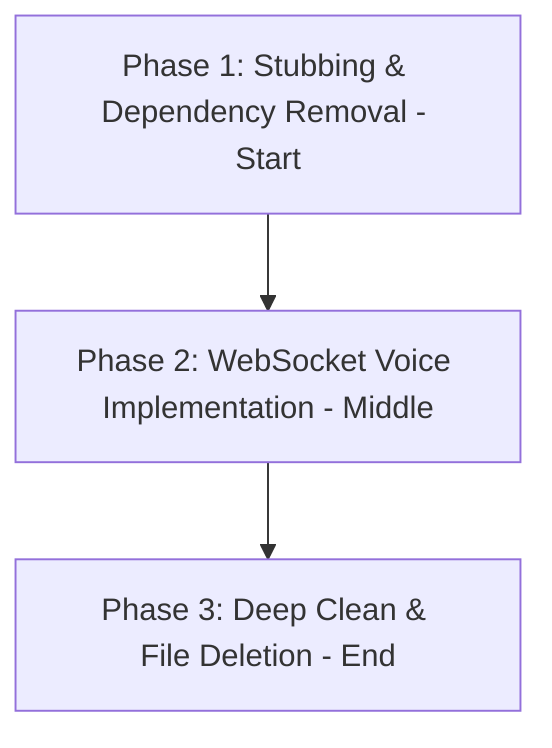

# LiveKit Deprecation & Purge Roadmap

This document outlines the systematic plan to deprecate and purge LiveKit dependencies across all components of the codebase (`sanad-client`, `backend`, and `agent`). Since we are moving towards a fully local, WebSocket-based duplex audio streaming architecture (as detailed in the [Realtime Duplex Voice Architecture Plan](realtime_voice_architecture.md)), LiveKit is no longer needed and should be cleanly excised to reduce binary size, dependencies, and code complexity.

---

## 🧭 Impacted Components & File Mappings

### 1. Client UI (`sanad-client/`)
- **Dependencies:** `pubspec.yaml` (contains `livekit_client` WebRTC dependency).
- **Services:**
  - `lib/infrastructure/livekit/room_service.dart`
  - `lib/infrastructure/livekit/room_event_listener.dart`
- **BLOCs & State:**
  - `lib/features/voice/presentation/bloc/call_cubit.dart`
- **Screens & Widgets:**
  - `lib/features/voice/presentation/screens/voice_agent_view.dart`
  - `lib/features/voice/presentation/widgets/control_bar.dart`

### 2. FastAPI Backend (`backend/`)
- **Configuration:** LiveKit server credentials and keys in `backend/app/core/config.py`.
- **APIs:** Session and room token generation endpoints in `backend/app/api/sessions.py` and `backend/app/services/session_service.py`.

### 3. Python Agent (`agent/`)
- **Workers:**
  - `agent/run_eaststar_ai.py` (LiveKit worker bootloader).
  - `agent/agents/eaststar_ai_agent.py` (LiveKit agent implementation).
- **Tests:** `agent/tests/integration/test_voice_link_flow.py` and related conftest configurations.

---

## 2. Phased Execution Strategy

To ensure development remains stable and does not permanently break compile targets, the purge must be conducted in three distinct phases:

### Phase 1: Stubbing & Dependency Removal (Start of Development)
*This phase must be executed first to shed the heavy LiveKit WebRTC dependencies from the compile pipeline.*

1.  **Remove Package Dependency:**
    *   Delete the `livekit_client` dependency from `sanad-client/pubspec.yaml` and run `fvm flutter pub get`.
2.  **Stub Room Services:**
    *   In `sanad-client/lib/infrastructure/livekit/room_service.dart` and `room_event_listener.dart`, replace the implementation with stub classes that throw `UnimplementedError` or return mocked values. This prevents compile errors while isolating LiveKit code.
3.  **Stub Blocs and Cubits:**
    *   In `sanad-client/lib/features/voice/presentation/bloc/call_cubit.dart`, remove references to `livekit_client` and change state triggers to stubs.
4.  **Clean Configurations:**
    *   Remove LiveKit env vars (`LIVEKIT_URL`, `LIVEKIT_API_KEY`, `LIVEKIT_API_SECRET`) from `.env.dev`, `.env.prod`, and all local configurations.

---

### Phase 2: WebSocket Voice Integration (Middle of Development)
*Implement the new local WebSocket duplex channel in parallel.*

1.  Follow the [Realtime Duplex Voice Architecture Plan](realtime_voice_architecture.md).
2.  Create new voice streaming blocs (`VoiceStreamCubit`) and widgets (`VoiceStreamView`) that interact with `sanadagent-local`'s WebSocket stream.
3.  Keep the stubbed `CallCubit` untouched or route calls to the new `VoiceStreamCubit`.

---

### Phase 3: Deep Clean & File Deletion (End of Development)
*Once the new WebSocket-based voice interaction is fully verified and stable, execute the final cleanup.*

1.  **Delete Client Files:**
    *   Delete the directory `sanad-client/lib/infrastructure/livekit/` entirely.
    *   Delete all legacy widgets and screens under `sanad-client/lib/features/voice/` that referenced the LiveKit call interface.
2.  **Clean Backend APIs:**
    *   Remove LiveKit token generators from `backend/app/api/sessions.py` and `backend/app/services/session_service.py`.
    *   Remove room tracking columns from database tables if they are no longer required for cross-device sync.
3.  **Clean Python Agent:**
    *   Delete `agent/run_eaststar_ai.py` and `agent/agents/eaststar_ai_agent.py` if they are no longer needed for cloud capabilities.
    *   Delete the LiveKit-specific test files under `agent/tests/`.
