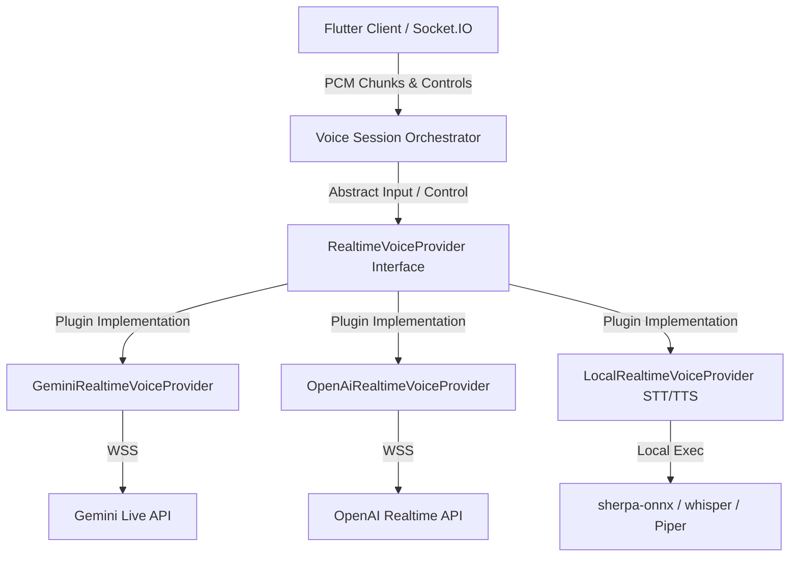
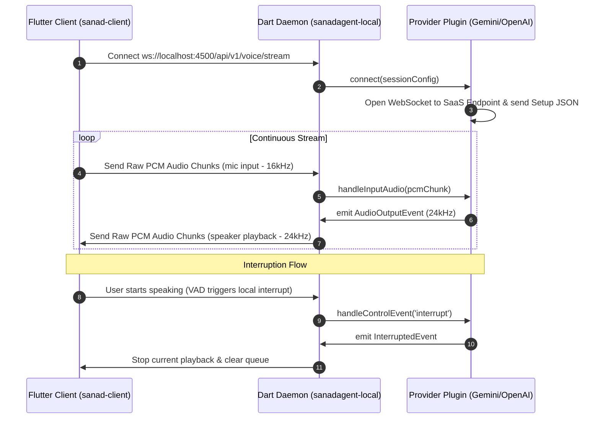
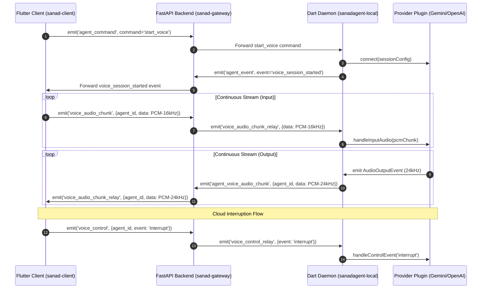

# Realtime Duplex Voice Architecture Plan

This document outlines the architectural blueprint for integrating a high-performance, low-latency, and pluggable voice interaction system into the `desktop-agent` ecosystem. It supports both **Realtime Duplex Streaming** (native audio-to-audio via Multimodal Live APIs) and **Turn-Based TTS/STT** fallback using an abstracted provider plugin system.

---

## 🧭 Project Architecture Context

- **Client Project:** [sanad-client](file:///sanad-client/) (Flutter UI)
- **Local Daemon Project:** [sanad-agent](file:///sanad-agent/) (Dart Backend)
- **FastAPI Gateway Project:** [backend](file:///backend/) (FastAPI Socket.IO Relay)

---

## 1. Plugin-Based Voice Provider Architecture

To avoid coupling the system to a single provider (like Gemini), we introduce a pluggable provider abstraction in `sanadagent-local`. The voice engine orchestrates sessions by routing client packets through a configured `RealtimeVoiceProvider` plugin.



### A. The `RealtimeVoiceProvider` Interface
Every voice assistant integration must implement this interface:

```dart
abstract class RealtimeVoiceProvider {
  // Connection & Handshake lifecycle
  Future<void> connect(Map<String, dynamic> sessionConfig);
  Future<void> close();

  // Audio & Control inputs from the client
  void handleInputAudio(List<int> pcmChunk16kHz);
  void handleControlEvent(String eventName, Map<String, dynamic> payload);

  // Output stream of standardized events routed back to the client
  Stream<RealtimeVoiceEvent> get outputEvents;
}
```

### B. Standardized `RealtimeVoiceEvent` Payload
Providers map vendor-specific response formats into a standardized event model:

```dart
abstract class RealtimeVoiceEvent {}

// Standardized binary PCM output (24kHz Mono 16-bit little-endian)
class AudioOutputEvent extends RealtimeVoiceEvent {
  final List<int> pcmChunk;
  AudioOutputEvent(this.pcmChunk);
}

// Live text transcript of the assistant's response (thought/speak tokens)
class TextResponseEvent extends RealtimeVoiceEvent {
  final String text;
  TextResponseEvent(this.text);
}

// Live text transcript of the user's voice (transcribed from input audio)
class UserTranscriptionEvent extends RealtimeVoiceEvent {
  final String text;
  UserTranscriptionEvent(this.text);
}

// Interruption trigger (VAD cut-off / Barge-in)
class InterruptedEvent extends RealtimeVoiceEvent {}
```

---

## 2. Dual-Scope Routing Architecture

The system operates in two connection modes based on the active `ConnectionScope` resolved by `AgentConnectionCoordinator`.

### Mode A: Local Connection Scope (`ConnectionScope.local`)

Direct low-latency WebSocket connection over `localhost` when the client and the daemon run on the same machine.



### Mode B: Cloud Connection Scope (`ConnectionScope.cloud`)

Audio chunks and control signals are routed via the FastAPI Backend's Socket.IO server when the client is remote.



---

## 3. Audio Format Specifications

To support unified player configurations in the Flutter client across multiple plugins, the client-side audio specifications are normalized:

| Stream Direction | Format | Sample Rate | Channels | Details |
| :--- | :--- | :--- | :--- | :--- |
| **Input (Microphone)** | Raw PCM | **16,000 Hz** (16kHz) | Mono | 16-bit little-endian |
| **Output (Speaker)** | Raw PCM | **24,000 Hz** (24kHz) | Mono | 16-bit little-endian |

> [!IMPORTANT]
> The Flutter client (`sanad-client`)'s playback engine **MUST** be initialized to play audio at **24,000 Hz**. Any voice provider that streams audio at a different rate (e.g. OpenAI streams at 24kHz; local system TTS might output at 16kHz or 22kHz) must have its output resampled by the provider implementation to **24kHz** Mono before emit, or the client must dynamically support playback rate changes. For ease of implementation, the provider plugin handles output resampling to 24kHz.

---

## 4. Socket.IO Event Schema (`backend` & `sanad-client`)

For **Cloud Scope**, the following events are implemented in the FastAPI Socket.IO manager:

### A. Client -> Backend -> Agent (Audio Input & Control)
1.  **`voice_audio_chunk`** (Client -> Backend):
    *   Payload: `{ "agent_id": "UUID", "data": <binary PCM 16kHz Mono> }`
2.  **`voice_audio_chunk_relay`** (Backend -> Agent):
    *   Payload: `{ "data": <binary PCM 16kHz Mono> }`
3.  **`voice_control`** (Client -> Backend -> Agent):
    *   Payload: `{ "agent_id": "UUID", "event": "interrupt" }`

### B. Agent -> Backend -> Client (Audio Output & Control)
1.  **`agent_voice_audio_chunk`** (Agent -> Backend):
    *   Payload: `{ "agent_id": "UUID", "data": <binary PCM 24kHz Mono> }`
2.  **`voice_audio_chunk_relay`** (Backend -> Client Room):
    *   Payload: `{ "agent_id": "UUID", "data": <binary PCM 24kHz Mono> }`

---

## 5. UI Integration Modes (No Separate Screen)

To maximize simplicity and maintain a unified user experience, we discard the separate voice call screen (`VoiceAgentView`) and instead integrate all voice functionality directly within the primary conversation page (`AgentInputPanel` & message list).

### Mode 1: Text Mode with Speech-to-Text Dictation
- The user interacts with the standard text chat input field (`TextField`).
- A **Microphone Button** is added to the text composer row.
- **Dictation Flow:**
  1. Clicking (or holding) the microphone button opens a real-time dictation stream.
  2. Microphone audio (16kHz PCM) is captured and streamed to the daemon's STT engine.
  3. The daemon processes the stream and returns partial transcripts in real-time.
  4. The client dynamically appends/updates the text inside the composer `TextField` as the user speaks.
  5. Upon silence detection (VAD) or tapping stop, the stream terminates. The user can review, edit, and send the transcribed text.

### Mode 2: Interactive Realtime Voice Mode
- A **Voice Chat Button** is added to the text composer row.
- **Voice Mode Transition Flow:**
  1. Tapping the Voice Chat Button initiates the duplex voice stream (Local WebSocket or Cloud Socket.IO).
  2. The text input `TextField` and Send button are hidden from the panel.
  3. In their place, **two real-time audio visualizers (Waveforms)** are rendered:
     - **User Waveform:** Visualizes local microphone amplitude (VAD meter).
     - **Agent Waveform:** Visualizes incoming agent audio amplitude.
  4. A red **Hang-Up / Exit Button** is displayed to stop the voice session and return to Text Mode.
- **Live Conversation History Rendering:**
  - As the user speaks, their live transcription is streamed (`UserTranscriptionEvent`) and rendered as a pending/streaming user message in the active chat list.
  - When the agent responds, its transcription (`TextResponseEvent`) and output audio (`AudioOutputEvent`) are received. The text is rendered as an active streaming agent message in the chat list synchronously with speaker output.

---

## 6. Tool Execution & Context Synchronization

Crucially, starting a voice session does not sand-box the assistant. The agent maintains **full context window memory** and **tool execution capabilities** (file tools, system tools, MCP tools) during voice interaction.

### A. Active Tool Execution (Function Calling)
- During connection initialization, the provider plugin registers the agent's available tools (`tools` configuration).
- If the model decides to run a tool, it suspends voice transmission and emits a tool call payload (e.g., Gemini `toolCall` or OpenAI `response.function_call`).
- The provider plugin routes this request to the daemon's local runner, executes the tool, and returns the result (e.g., Gemini `toolResponse` or OpenAI `tool_response`).
- The model processes the result and continues speaking, verbally reporting the outcome to the user (e.g., *"I have analyzed the config file and fixed the issue on line 12."*).

### B. Message & History Database Persistence
- When a voice session begins, the current active thread history (text chat history) is loaded and sent as history turns to seed the voice model.
- During the voice call, the provider plugin accumulates user transcriptions and assistant text responses in memory.
- Upon ending the call, the transcribed voice dialog is compiled and appended to the active database thread, ensuring a seamless visual representation of the voice session in the text chat history.

---

## 7. Verification Plan

### Automated Tests
- **Provider Plugin Tests:** Write tests in `sanadagent-local/test/voice/` mocking SaaS WebSocket connections and asserting that output is properly mapped to `RealtimeVoiceEvent` objects.
- **Relay Tests:** Verify that Socket.IO events are routed correctly between client and daemon namespaces on the backend.
